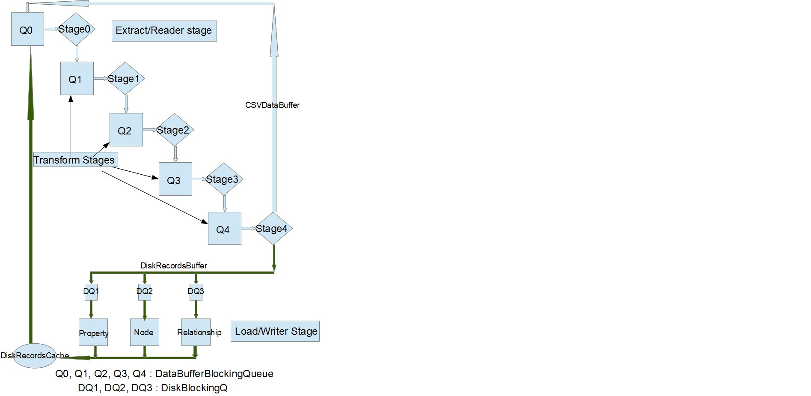

= New Batch Importer: Parallel and Scalable

The current serial importer is simple and easy to use but does not
scale well even for medium data sets of > 50 million nodes. The
parallel importer is hard to use and has several prerequisites (such as
sorted relationships, listing of relationship types, etc) that may not
work for large datasets, and is not functionally equivalent to serial
importer (e.g., can not handle labels, etc).

The objective for the new batch importer is to be easy to use and functionally
equivalent to the serial importer and must perform and scale like the
parallel importer. This objective was fully achieved in the new
importer, with 

* a new parallel architecture that optimally exploits the available resources - memory and cpus
* a new Relationship linking algorithm that minimizes the updates and completely avoids the random access of relationships that
kills performance and scalability for large datasets, and
    
* the design to maximize the throughput of writers (that output data), since I/O is the limiting factor for performance.

== Architectural overview

        
*Parallelism:*
The architecture of the new importer supports 2 dimensions of parallelism:

* Pipelined parallelism - This is based on classical ETL architecture. 
    
  
* Extract - The data is received or read, parsed, and packaged into series of chunks of configurable size, marked with sequence numbers. This represents the Reader or Extractor. 
      
* Transform - The data chunks from reader are passed along through a pipeline, implemented by a series of queues, with each **Stage
handling data movement from one queue (input queue) to the next queue
(output queue). Each stage dequeues a data chunk from its input queue,
processes the data (Transform), and queues it to its output queue.
Hence a "Stage" consists of two queues (input and output) together with
the associated logic, called Stage methods, to process the data. Typically, there will be more than one transform stage to optimally exploit parallelism potential of the execution environment. The various transform stages represent the sequence of steps for data transformation from input to output.
* The final stage is typically a writer or loader stage that
either writes to persistent store or interfaces with another
application to pass the data. 
      
  
* Stage parallelism: Within each stage there is a potential
for parallelism. Each stage could be serviced by one or more execution
entities (threads) depending on the semantics of the stage.
  
* Single threaded stage: These are stages that represent the
logic that is sensitive to ordering of data or some other attribute
that forces this restriction. It is imperative to carefully
design these stages to minimum and very simple because this represents
a bottleneck in the logic and has to be executed very quickly. A good
design with these will avoid use of synchronized methods that are very
expensive.
* Multi threaded stage: This is unrestricted and can be serviced by as many threads as one needs.
  

*Stage design: *
The objective of good design in pipelined architecture is to avoid
stages that act as bottlenecks in the pipeline. Obviously, avoiding
single threaded stage is critical but can not be avoided in many
circumstances for correctness. Also, for multi threaded stages, the
design should allow optimal use of execution entities (threads)
to assure optimal flow of data through the pipeline without unnecessary
wait. With these objectives, the current design is grouped into 2 stage
types:

  
* Import stages: These include both the reader and transform stages. The
number of threads used to service these stages is equal to number of
available processors or number of stages, whichever is higher.
      
    
* Reader stage: This is typically a single stage and is
multi threaded. This stage reads the data, parses and packages it into
data chunks. 
* Transform stages: Optimally designed to limit the single
threaded stages, and in the current design only one of the stages is
single threaded for both node and relationship import phases. The
current design uses a carefully designed algorithm (discussed in next
section) that limits the use of single threaded stages.
        
    
* Writer Stages : This stage is serviced by completely independent set of threads that are set to run at a higher priority. Since they are typically
I/O bound and do not compete for CPU, their number is not dependent on
number of available cpus but instead on the number of stores. In the
current design, one thread is spawned for each of node, relationship,
and property stores. But the current design allows extension in the
following ways:
      
    
* a thread for each additional stores such as label store, property string store, etc.
* multiple threads for any one type of store.
    
  

*Data handling buffers: *The
design uses 2 types of data buffers - CSVDataBuffer and
DiskRecordsBuffer. This was done to delink the input data
processing/transformation from the writing of data to the disk. Before
the reader stage, i.e., before the data is read, an CSVDataBuffer is
paired with a DiskRecordsBuffer, which is delinked in the final stage
of transformation

* The CSVDataBuffer is populated by the reader from the csv
input. In the current version, the raw data is maintained as is and the
parser generates a set of (start, end) indexes into the input data
representing the various fields of the csv data. Initially, there was a
suspicion that reader stage could be bottleneck and hence this approach
was chosen to avoid creation/destruction of immutable strings. But very
soon, it was discovered that reader is not the bottleneck but the logic
has remained the same. In fact, the use of openCSV parser, which is
part of this implementation (by setting UseQuotes option) has no impact
on the performance.

* The DiskRecordsBuffer is a collection of records that are ready to be written to disk by the writers. In the
final stage of transformation, the disk records buffer is
delinked from the CSVDataBuffer and queued into the
DiskBlockingQ from which the writers pick up the data. 
    

*Blocking queues: *The design used 2 blocking queues - DataBufferBlockingQ and DiskBlockingQ

* The DataBufferBlockingQ implements a part of the data
pipeline (of CSVDataBuffers) with the other part handled by the stages.
This contains as many ArrayBlockingQueues as the number of stages and
each stage is responsible for moving the data from one queue to the
next.
* The DiskBlockingQ implements the data pipeline (of DiskRecordsBuffer) between the Import stages and writer stage. 
  

*Thread distribution: *Threads
can be assigned or pinned to a stage or remain unassigned. In the first
round, each stage is assigned a thread to avoid starvation of any
stage. If there are sufficient threads available, then additional
threads are assigned to stages starting from stage 0 till the number of
assigned threads is greater than half the total number. The rest of the
threads are left unassigned to service the stage that has maximum
number of data chunks in their input queue, to unclog the bottleneck.

*Memory usage: *The memory
requirement is primarily dectated by the number of nodes for
nodesCache, with rest of the requirement being constant (about 2G). The
nodeCache is implemented as an array of longs (a long is 8 bytes long -
64bit). Hence for every billion nodes, the memory requirement is
7.45GB. So, in a 16GB m/c (a typical desktop), it can handle up to
1.5billion nodes, and on a 64GB m/c (typical server) it can handle
7billion nodes. For larger workloads, higher memory would be required.

== New Algorithm:

* Node import: while (not EOF)
    
  
* read and parse data
* assign or process (with ID column) node ids, process labels and create node records.
* encode props, 
      
* set property ids and create property chain, and link it to node records 
* write property records and node records.
  
* Create in-memory node id cache (an array of longs) - +nodeCache+
    
* Relationship import: while (not EOF)
  
* read and parse data.
* assign relationship id, create relationship records, process labels
      
* encode props
* process property and relationship records
      
    
* set property ids and create property chain, and link it to relationship records
* update relationship records, +firstNextRel+ and +secondNextRel+ by exchanging values with +nodeCache+.
    
* write property records and relationship records
  
* Update +nextRel+ of node record using +nodeCache+ and write node records, reset +nodeCache+
    
* Relationship Link Back: Read the relationship store backwards
  
* From highest relationship id to 0:
    
* read the relationship record
* update the +firstPrevRel+ and +secondPrevRel+ by exchanging values with the +nodeCache+
* write relationship records.
    
  

As per this algorithm, if N is number of nodes, R is number of relationships, P1 properties/node, P2 properties/relation

* in step 1.5 (node import), N nodes + P1*N property records are written
* in step 2.5 (relationship import) - R relationships + P2*R property records are written
* in step 5, N node records are written
* in step 5, R relationships are written

Total bytes written (only of nodes, relationships, properties) = 2N * 14 + 2R * 33 + (P1*N+P2*R) * 41 bytes

=== Code Navigation:

+org.neo4j.batchimport.NewImporter:+

* This class contains the main class for the new importer. 
    
* This is one of only 2 files (the other is +batchInserterImplNew+) outside of package +org.neo4j.batchimport.newimport+ that contains code for the new importer.
* This class is based on the serial importer main class - +org.neo4j.batchimport.Importer+.
* The logic is almost same as the Importer class at the top level till +doImport()+.
* Apart from Importer logic, this class contains logic specific to new importer:
  
* creation and set up of import stages - importStages - +setupStages()+
* creation and set up of writer stages -+ setWriterStages()+
      
* initialization of importStages for node import - +setupStagesForNodes()+
* initialization of importStages for relationship import - +setupStagesForRelationships()+
* common method to execute the stages-+  importNew()+ 
* +nodeCache+ creation for the next link back step -+ NodesCache()+
      
* call to new relationship link back logic that also contains updating the nodes -+ linkBackRelationships()+
    
  

+org.neo4j.batchimport.newimport.stages+:

* this package contains most of the classes related implementing the stages architecture.   
    
  
* +Stages+: This is the main class of the stages architecture, and contain the lifecycle methods of +ImportWorker+ - to create, execute, and destroy the components of stages.
      
* +StageMethods+: Contains the methods that define each stage. Typically, each stage is made up of calls to methods in +BatchInserterImplNew+.
* +ImportWorker+: This is the container for an execution entity (thread) to execute a stage.
* +ReadFileData+, +DataChunker+: This contain the logic for Reader or Extract stage.
* +WriterStage+: This contains the lifecycle methods of writers - to create, execute, and destroy write workers/
* +WriteWorker+ - This the container for the writers.
  

+org.neo4j.batchimport.newimport.structs:+

* this package contains the data structures to hold data.
  
* +AbstractDataBuffer+: This is the super class containing the definition and methods to populate the buffer and retrieve data.
      
* +Constants+ : contains all the constants used with +NewImporter+
      
* +CSVDataBuffer+: this extends the +AbstractDataBuffer+ for CSV data.
      
* +DataBufferBlockingQueue+:
This implements a part of the data pipeline as an array of blocking
queues. Also it contains the methods to add and remove the buffers from
the queues. 
      
* +DiskBlockingQ+: This implements the data pipeline that feeds the writers/
      
* +DiskRecordsBuffer+: This implements the container for the disk records that are ready to written to disk:
      
* +DiskRecordsCache+: This acts as repository of empty +DiskRecordsBuffer+ for reuse with the +CSVDataBuffer+.
      
* +NodeCache+:
This implements the in-memory node cache. Since array index size is
limited to a max integer size, a series of arrays is used. 
      
* +RunData:+
This contains data structure/methods to track the performance and
execution info. Will be significantly reduced before the final release.
    
  

+org.neo4j.batchimport.newimport.utils:+

*  this package contains the common utility classes
  
* +utils:+ contains all the common utility methods.
  

+org.neo4j.unsafe.batchinsert.BatchInserterImplNew:+

*  This class extends the +BatchInserterImpl+, with all the methods and logic to implement the stages.
  

